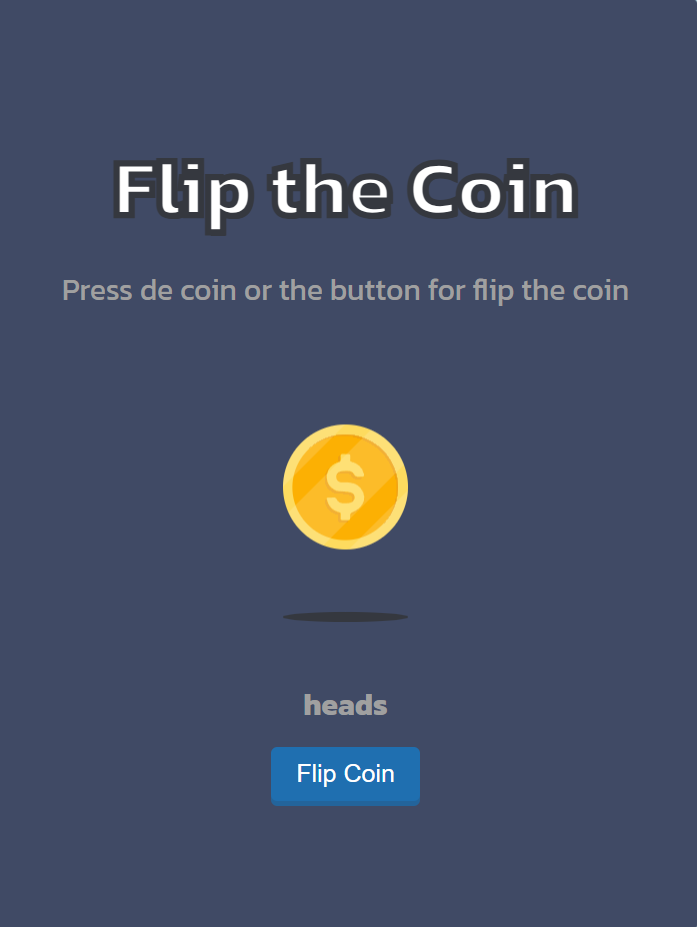

<!-- Please update value in the {}  -->

<h1 align="center">flippy coin | devChallenges</h1>

   Solution for a challenge <a href="https://devchallenges.io/challenge/flip-the-coin" target="_blank">Flip The Coin</a> from <a href="http://devchallenges.io" target="_blank">devChallenges.io</a>.

  <h3>
    <a href="https://cruzhumbeto.github.io/flippy-coin/">
      Demo
    </a>
     | 
    <a href="https://github.com/CruzHumbeto/flippy-coin">
      Solution
    </a>
     | 
    <a href="https://devchallenges.io/challenge/flip-the-coin">
      Challenge
    </a>
  </h3>

<!-- TABLE OF CONTENTS -->

## Table of Contents

- [Table of Contents](#table-of-contents)
- [Overview](#overview)
  - [What I learned](#what-i-learned)
  - [Useful resources](#useful-resources)
  - [Built with](#built-with)
- [Features](#features)
- [Author](#author)

<!-- OVERVIEW -->

## Overview
| image | gif |
|--------|-----|
|  |  |

This is a quick and fun project to practice CSS animations and JavaScript event handling, it's a simple coin flip game, you can flip the coin and see if it lands on heads or tails.

This project is part of the devChallenges.io challenges.

### What I learned
In this project I enjoyed the process of creating the coin flip animation and the logic behind it. I also learned how to use CSS animations through `@keyframes` and `animation` properties.

### Useful resources

[La regla @keyframes](https://lenguajecss.com/animaciones/animaciones/keyframes/) - This helped me to understand the syntax and usage of @keyframes.

[Animaciones](https://web.dev/learn/css/animations?hl=es-419) - This helped me to understand the syntax, properties and some tricks to use with CSS animations.

[Animaciones CSS: Uso de keyframes con la propiedad animation](https://www.eniun.com/animaciones-css-keyframes-propiedad-animation/) - This helped me to understand the syntax and usage of @keyframes.

[@keyframes](https://developer.mozilla.org/es/docs/Web/CSS/Reference/At-rules/@keyframes) - This helped me to learn about the rules and limitations of @keyframes.

### Built with

- Semantic HTML5 markup
- CSS custom properties
- Flexbox
- Vanilla JavaScript

## Features

This application/site was created as a submission to a [DevChallenges](https://devchallenges.io/challenges-dashboard) challenge.

## Author

- GitHub [@CruzHumbeto](https://github.com/CruzHumbeto)
